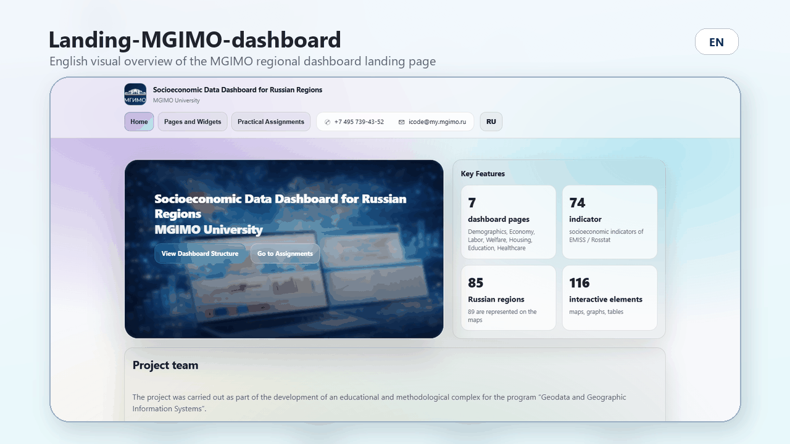
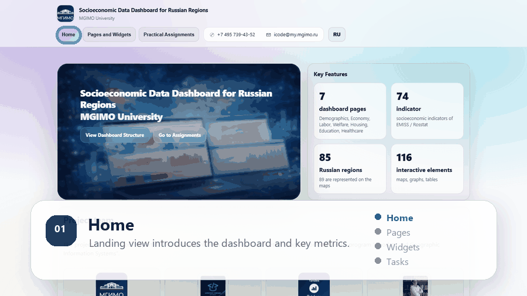
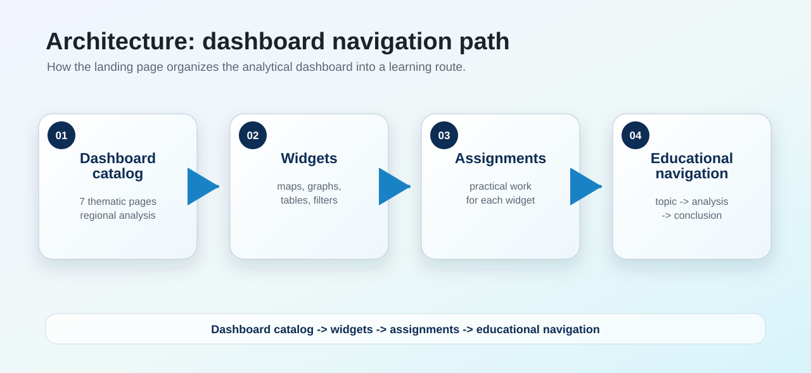
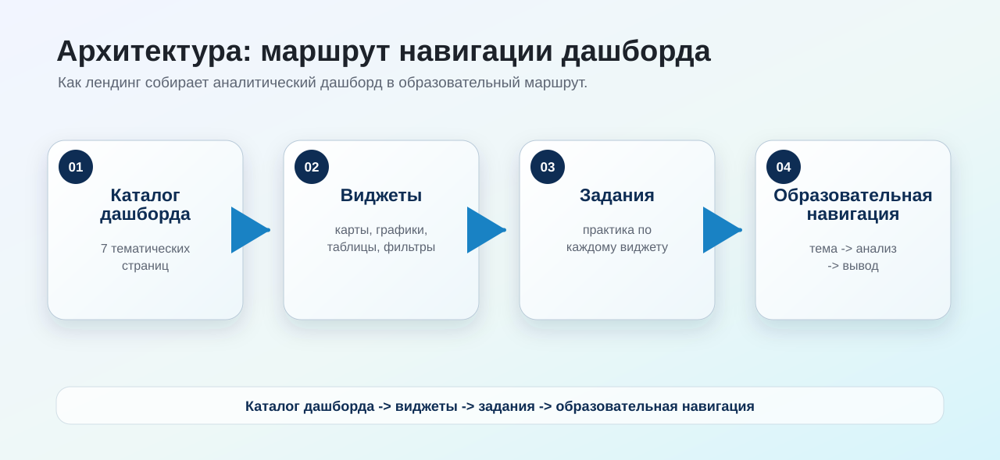

# MGIMO Regional Socio-Economic Dashboard · Landing Page

[English](#english) · [Русский](#русский)

[](https://arseniy24rus.github.io/Landing-MGIMO-dashboard/)
[](LICENSE)
[](https://creativecommons.org/licenses/by/4.0/)

---

## English

### Overview

`Landing-MGIMO-dashboard` is a static landing page for a socio-economic dashboard of Russian regions developed for the educational process at MGIMO University. The landing page explains the purpose of the dashboard, its thematic structure, methodological role and connection with a broader teaching complex in geodata and geographic information systems.

The project is not the full analytical dashboard itself; it is the public entry page that introduces the dashboard, directs users to the main analytical interface and describes the educational context in which the dashboard is used.

### Visual overview








### Live page

GitHub Pages: <https://arseniy24rus.github.io/Landing-MGIMO-dashboard/>

### Educational and analytical role

The dashboard described by this landing page is oriented toward teaching students to work with regional socio-economic data: from data selection and indicator interpretation to visualization, comparison of territories, analytical conclusions and policy recommendations. It supports courses and assignments related to geodata, geographic information systems, public administration, economics, international relations, political science, business informatics and data analysis.

For research-readiness details, see [Methodology and Research Readiness](docs/methodology.md).

### Thematic content

The landing page presents a dashboard covering key blocks of regional socio-economic analysis:

```text
Demography
Economy
Labour market
Welfare and quality of life
Housing and urban environment
Education
Healthcare
```

The dashboard is described as a multi-page interactive environment with dozens of indicators and more than one hundred visual elements, including maps, graphs, tables, filters and explanatory components.

### Repository structure

```text
assets/     Images, CSS and front-end resources
index.html  Main landing page
README.md   Project documentation
.nojekyll   GitHub Pages service file
```

### Configuration

The landing page may contain configurable links to the dashboard and source repository. When adapting the page, check the following constants or link blocks in `index.html`:

```text
DASHBOARD_URL  Target URL of the analytical dashboard
REPO_URL       Repository or documentation URL
```

### Deployment

The project is a static site and can be published directly through GitHub Pages from the repository root. No build step is required for the basic version.

Local launch:

```bash
python -m http.server 8000
```

Then open <http://localhost:8000/>.

### Citation

If you use the landing page structure, educational description or methodological framing, please cite:

> Sitkovskiy, A. M. (2026). MGIMO Regional Socio-Economic Dashboard: landing page and educational framing. GitHub. https://github.com/Arseniy24RUS/Landing-MGIMO-dashboard

### License

License matrix:

| Material | License / terms |
| --- | --- |
| Source code | [MIT](LICENSE) |
| Documentation, data descriptions and educational content | [CC BY 4.0](LICENSE-DOCS-AND-DATA.md) |
| Third-party names, logos, screenshots, platforms and source datasets | Original rights and terms; see [Third-Party Notices](THIRD_PARTY_NOTICES.md) |

---

## Русский

### Обзор

`Landing-MGIMO-dashboard` — статический лендинг дашборда социально-экономических данных субъектов Российской Федерации, разработанного для использования в учебном процессе МГИМО. Лендинг объясняет назначение дашборда, его тематическую структуру, методическую роль и связь с более широким учебно-методическим комплексом по геоданным и геоинформационным системам.

Проект не является полным аналитическим дашбордом; это публичная входная страница, которая представляет дашборд, направляет пользователя к основной аналитической платформе и описывает образовательный контекст его применения.

### Визуальный обзор





### Публичная страница

GitHub Pages: <https://arseniy24rus.github.io/Landing-MGIMO-dashboard/>

### Учебная и аналитическая роль

Дашборд, представленный на лендинге, ориентирован на обучение студентов работе с региональными социально-экономическими данными: от отбора данных и интерпретации показателей до визуализации, сравнения территорий, аналитических выводов и управленческих рекомендаций. Он поддерживает курсы и задания, связанные с геоданными, геоинформационными системами, государственным управлением, экономикой, международными отношениями, политологией, бизнес-информатикой и анализом данных.

Подробнее о методологии и исследовательской готовности см. [Methodology and Research Readiness](docs/methodology.md).

### Тематическое содержание

Лендинг представляет дашборд, охватывающий ключевые блоки регионального социально-экономического анализа:

```text
Демография
Экономика
Рынок труда
Благосостояние и качество жизни
Жильё и городская среда
Образование
Здравоохранение
```

Дашборд описывается как многостраничная интерактивная среда с десятками показателей и более чем сотней визуальных элементов, включая карты, графики, таблицы, фильтры и пояснительные компоненты.

### Структура репозитория

```text
assets/     Изображения, CSS и фронтенд-ресурсы
index.html  Главная страница лендинга
README.md   Документация проекта
.nojekyll   Служебный файл GitHub Pages
```

### Настройка

Лендинг может содержать настраиваемые ссылки на дашборд и исходный репозиторий. При адаптации страницы проверьте следующие константы или блоки ссылок в `index.html`:

```text
DASHBOARD_URL  Целевой URL аналитического дашборда
REPO_URL       URL репозитория или документации
```

### Публикация

Проект является статическим сайтом и может публиковаться напрямую через GitHub Pages из корня репозитория. Для базовой версии этап сборки не требуется.

Локальный запуск:

```bash
python -m http.server 8000
```

Затем откройте <http://localhost:8000/>.

### Как цитировать

При использовании структуры лендинга, образовательного описания или методического позиционирования, пожалуйста, цитируйте:

> Ситковский А. М. MGIMO Regional Socio-Economic Dashboard: landing page and educational framing. GitHub, 2026. https://github.com/Arseniy24RUS/Landing-MGIMO-dashboard

### Лицензия

Матрица лицензий:

| Материал | Лицензия / условия |
| --- | --- |
| Исходный код | [MIT](LICENSE) |
| Документация, описания данных и образовательный контент | [CC BY 4.0](LICENSE-DOCS-AND-DATA.md) |
| Сторонние названия, логотипы, скриншоты, платформы и исходные наборы данных | Исходные права и условия; см. [Third-Party Notices](THIRD_PARTY_NOTICES.md) |
